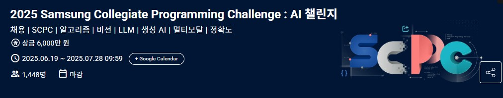
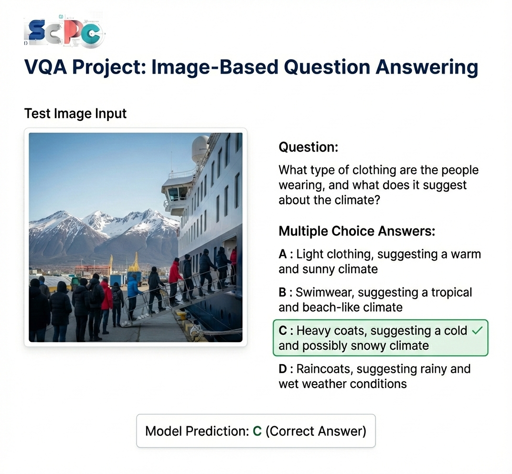

<p align="center">
  
</p>

<h1 align="center">OFA + Phi-2 Pipeline for Visual Question Answering</h1>

<p align="center">
  <b>2-Stage VQA System: Visual Understanding & Text Reasoning within 3B Parameters</b>
</p>

<p align="center">
  
  
  
  
  
</p>

<p align="center">
  
  
  
</p>

---

## Competition Info

| Item | Description |
|:-----|:------------|
| **Competition** | 2025 Samsung Collegiate Programming Challenge (SCPC) : AI Challenge |
| **Host** | Samsung Electronics |
| **Period** | 2025.06.19 ~ 2025.07.28 |
| **Prize** | 60,000,000 KRW |
| **Participants** | 1,448 teams |
| **Final Rank** | 🏆 **4th Place** |
| **Task** | Visual Question Answering (Multiple Choice) |

---

## Problem Definition

Given a smartphone gallery image and a multiple-choice question, predict the correct answer.

- **Input**: Image + Question + 4 Choices (A, B, C, D)
- **Output**: Predicted Answer (A, B, C, D)
- **Metric**: Weighted Accuracy

$$\text{Weighted Accuracy} = \frac{\sum_{i=1}^{N} \mathbf{1}[\hat{y}_i = y_i] \cdot w_i}{\sum_{i=1}^{N} w_i}$$

<p align="center">
  
</p>

---

## Constraints

This competition imposed strict constraints on model usage:

| Constraint | Specification |
|:-----------|:--------------|
| **Model Size** | Total parameters must be **< 3B** (including all models loaded during inference) |
| **Pre-trained Models** | Only models released before **2023.12.31** with open-source license |
| **API Usage** | **Prohibited** (No OpenAI, Gemini, or any remote API calls) |
| **External Data** | Only data released before **2025.06.10** with proper license |

> ⚠️ **Important**: Even if models are loaded sequentially and unloaded from memory, the **sum of all loaded parameters** counts toward the 3B limit.
> Example: Loading 10 × 2B models sequentially = 20B total → **Rule Violation**

---

## Dataset

| Split | Images | Samples | Description |
|:------|:------:|:-------:|:------------|
| Train | 60 | 60 | `TRAIN_000.jpg` ~ `TRAIN_059.jpg` |
| Test | 852 | 852 | `TEST_000.jpg` ~ `TEST_851.jpg` |

### Data Schema

```
train.csv / test.csv
├── ID          : Sample unique identifier
├── img_path    : Image file path
├── Question    : Question text
├── A, B, C, D  : Multiple choice options
└── answer      : Ground truth (train only)
```

> Note: With only **60 training samples**, fine-tuning is impractical. This motivated our **zero-shot pipeline approach** with prompt engineering.

---

## Model Architecture

<p align="center">
  
</p>

### Overview

We propose a **2-stage pipeline** that separates visual understanding from logical reasoning:

| Stage | Model | Parameters | Role |
|:------|:------|:----------:|:-----|
| Stage 1 | **OFA-base** | ~180M | Visual Understanding & Image Captioning |
| Stage 2 | **Phi-2** | ~2.78B | Text Reasoning & Answer Selection |
| **Total** | - | **~2.96B** | **< 3B Limit ✓** |

### Stage 1: Visual Understanding (OFA-base)

OFA (One For All) is a unified multimodal model specialized for vision-language tasks.

**Multi-Question Strategy**: Instead of a single caption, we extract richer information using 4 different prompts:

```python
questions = [
    "what do you see in the image?",        # General observation
    "what does the image describe?",         # Contextual understanding
    "what are the objects in the image?",    # Object identification
    specific_question                        # Original question from dataset
]
```

All responses are concatenated to create a comprehensive image description.

### Stage 2: Text Reasoning (Phi-2)

Microsoft's Phi-2 (2.78B) provides strong reasoning capabilities in a compact size.

**Prompt Template**:
```
Based on the image description and question, select the most probable answer

Image: {concatenated_captions}
Question: {question}
A) {choice_a}
B) {choice_b}
C) {choice_c}
D) {choice_d}

Answer:
```

### Key Design Decisions

1. **No Fine-tuning**: With only 60 training samples, we rely on pre-trained knowledge
2. **Memory Optimization**: Float16 inference reduces VRAM usage by 50%
3. **Deterministic Output**: `temperature=0.0` ensures reproducibility
4. **Error Handling**: 100% response guarantee with fallback mechanisms

---

## Project Structure

```
samsung-vqa-challenge/
├── README.md
├── requirements_ofa.txt          # OFA environment (Python 3.9)
├── requirements_phi.txt          # Phi-2 environment (Python 3.10)
│
├── assets/
│   ├── logo.jpg                  # Competition logo
│   ├── model architecture.png    # Architecture diagram
│   └── testdata.png              # VQA example
│
├── src/
│   ├── inference.py              # Unified inference pipeline
│   ├── ofa_captioning.py         # Stage 1: OFA image captioning
│   └── phi_reasoning.py          # Stage 2: Phi-2 answer prediction
│
├── weights/
│   ├── ofa_model_weights/        # OFA-base model & tokenizer
│   │   ├── ofa_model/
│   │   ├── ofa_tokenizer/
│   │   └── ofa_config.json
│   │
│   └── phi_model_weights/        # Phi-2 model & tokenizer
│       ├── phi_model/
│       ├── phi_tokenizer/
│       └── model_config.json
│
└── data/
    ├── train.csv
    ├── test.csv
    ├── train_input_images/
    └── test_input_images/
```

---

## Installation

### Environment Setup

Due to dependency conflicts, OFA and Phi-2 require **separate environments**:

```bash
# Clone repository
git clone https://github.com/yourusername/samsung-vqa-challenge.git
cd samsung-vqa-challenge

# OFA environment (Python 3.9)
conda create -n ofa python=3.9
conda activate ofa
pip install -r requirements_ofa.txt

# Phi-2 environment (Python 3.10)
conda create -n phi python=3.10
conda activate phi
pip install -r requirements_phi.txt
```

### Model Weights

Download pre-trained weights and place them in `weights/` directory:

| Model | Source | Parameters |
|:------|:-------|:----------:|
| OFA-base | [Hugging Face](https://huggingface.co/OFA-Sys/ofa-base) | 180M |
| Phi-2 | [Hugging Face](https://huggingface.co/microsoft/phi-2) | 2.78B |

---

## Usage

### Full Pipeline Inference

```bash
python src/inference.py \
    --test_csv ./data/test.csv \
    --test_images ./data/test_input_images \
    --output ./results/submission.csv
```

### Step-by-Step Execution

```bash
# Step 1: Generate image captions with OFA
conda activate ofa
python src/ofa_captioning.py

# Step 2: Predict answers with Phi-2
conda activate phi
python src/phi_reasoning.py
```

### Configuration

Key hyperparameters in `ofa_config.json`:

| Parameter | Value | Description |
|:----------|:-----:|:------------|
| `image_resolution` | 480 | Input image size |
| `beam_size` | 8 | Beam search width |
| `max_len_b` | 120 | Max caption length |
| `no_repeat_ngram_size` | 3 | N-gram blocking |

---

## Results

### Performance

| Metric | Score |
|:-------|------:|
| **Private Score** | **0.79854** |
| Baseline | 0.694 |
| **Improvement** | **+15.1%** |

### Answer Distribution

```
A: 213 (25.0%)
B: 198 (23.2%)
C: 221 (25.9%)
D: 220 (25.8%)
```

### Ablation Study

| Configuration | Score |
|:--------------|------:|
| Single caption only | 0.694 |
| Multi-question strategy | **0.79854** |

The multi-question strategy significantly improved performance by capturing diverse aspects of each image.

---

## Development Environment

| Component | Specification |
|:----------|:--------------|
| OS | Windows 10/11 (64-bit) |
| GPU | NVIDIA GeForce GTX 1080 Ti |
| CUDA | 11.7 |
| cuDNN | 8.5 |

---

## References

- **OFA**: Wang et al., "OFA: Unifying Architectures, Tasks, and Modalities Through a Simple Sequence-to-Sequence Learning Framework", ICML 2022
- **Phi-2**: Microsoft Research, "Phi-2: The surprising power of small language models", 2023

---

## Citation

```bibtex
@misc{lee2025ofaphi2vqa,
  author = {Lee, Juhun},
  title = {OFA + Phi-2 Pipeline for Visual Question Answering},
  year = {2025},
  publisher = {GitHub},
  howpublished = {\url{https://github.com/yourusername/samsung-vqa-challenge}},
  note = {Samsung Collegiate Programming Challenge 2025 - AI Challenge}
}
```

---

## License

This project is licensed under the MIT License - see the [LICENSE](LICENSE) file for details.

---

## Contact

**Juhun Lee**
- GitHub: [@juhun7777](https://github.com/juhun7777)
- Email: juhun7777@gmail.com

---

<p align="center">
  <i>Developed for Samsung Collegiate Programming Challenge 2025</i>
</p>
